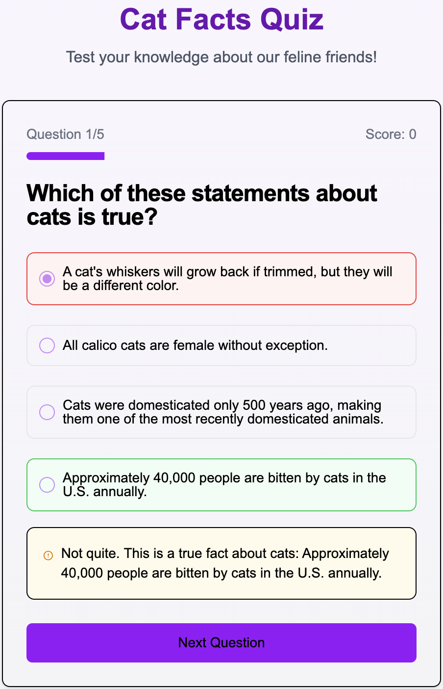

# 🐱 Cat Facts Quiz

A fun, interactive quiz application that tests your knowledge about cats using facts from the Cat Facts API.



## Features

- **Dynamic Quiz Generation**: Fresh questions generated from real cat facts
- **Multiple Question Types**: True/False, multiple choice, and fill-in-the-blank questions
- **Educational Content**: Learn interesting facts about cats with detailed explanations
- **Randomized Experience**: Different questions each time you play
- **Score Tracking**: Keep track of your performance
- **Responsive Design**: Works on desktop, tablet, and mobile devices

## Technologies Used

- **Next.js**: React framework for the frontend
- **TypeScript**: For type-safe code
- **Tailwind CSS**: For styling
- **shadcn/ui**: For UI components
- **Cat Facts API**: For fetching cat facts (https://catfact.ninja/)

## Installation

1. Clone the repository:

```bash
git clone https://github.com/yourusername/cat-facts-quiz.git
cd cat-facts-quiz
```

2. Install Dependencies:

```bash
npm install
# or
yarn install
# or
pnpm install
```

3. Run the development server:

```bash
npm run dev
# or
yarn dev
# or
pnpm dev
```

4. Open [http://localhost:3000](http://localhost:3000) in your browser to see the application.

## How It Works

### Quiz Generation

The application fetches cat facts from the [Cat Facts API](https://catfact.ninja/) and transforms them into quiz questions. The quiz includes:

1. **Predefined Questions**: Expert-created questions about cat biology, behavior, and characteristics
2. **API-Based Questions**: Questions generated directly from the cat facts, including:
    - True/False questions
    - Fill-in-the-blank questions
    - "Which statement is true" questions

### Question Variety

To ensure a fresh experience each time:

- The app requests 30 facts but only uses a subset
- Facts are shuffled and randomly selected
- A random parameter is added to API requests to avoid caching
- Quiz rounds are tracked to force new facts on restart
- Multiple question formats are used

### Scoring and Feedback

- Immediate feedback after answering each question
- Detailed explanations for both correct and incorrect answers
- Final score display with encouraging messages
- Option to restart with new questions

## Project Structure

```plaintext
cat-facts-quiz/
├── app/
│   ├── page.tsx         # Main page component
│   └── layout.tsx       # App layout
├── components/
│   ├── cat-quiz.tsx     # Main quiz component
│   └── ui/              # UI components
└── README.md            
```

## Credits

- Cat facts provided by [Cat Facts API](https://catfact.ninja/)
- UI components from [shadcn/ui](https://ui.shadcn.com/)
- Icons from [Lucide React](https://lucide.dev/)
